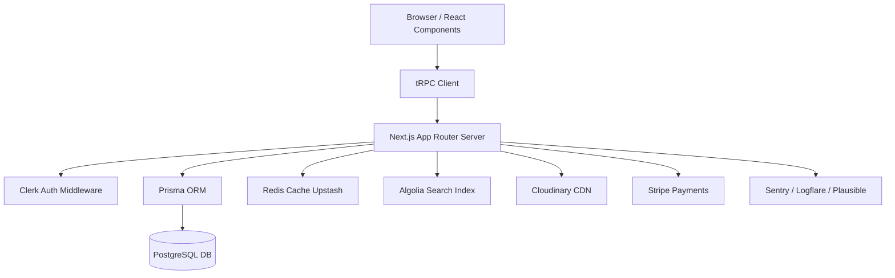

# 🧱 TopZonal.ro — Technical Architecture & Engineering Stack

> **Project Type:** SaaS / Listings & Discovery Platform
> **Framework:** Next.js 16 (App Router)
> **Language:** TypeScript

---

## 🚀 Overview

**TopZonal.ro** is a modern, scalable, SEO-first web application designed to host listings, reviews, and user-generated content across regions (“zones”).

It uses a fully **type-safe, cloud-native** architecture centered around **Next.js App Router**, **Prisma ORM**, and **tRPC**, supported by **Clerk**, **Redis**, **Stripe**, and **Cloudinary** for real-world production performance and developer velocity.

---

## 🧩 Core Philosophy

- **SEO-first:** Every page server-rendered via Next.js App Router (SSR + ISR).
- **End-to-end Type Safety:** All data flows strongly typed via Prisma + tRPC.
- **Serverless & Scalable:** Deployed on Vercel with edge caching, CDN, and Redis.
- **Feature-based Architecture:** Code structured by business domain, not by type.
- **Ownership & Control:** All UI components local (`shadcn/ui`) — no black-box libraries.
- **Monitoring-first:** Sentry, Logflare, and Plausible integrated for full observability.

---

## 🧠 Primary Tech Stack

| Category               | Technology                  | Purpose / Justification                                         |
| ---------------------- | --------------------------- | --------------------------------------------------------------- |
| **Framework**          | **Next.js 16 (App Router)** | Server Components, SEO, edge rendering, file-based routing      |
| **Language**           | **TypeScript**              | Type safety, refactoring, self-documented APIs                  |
| **Styling**            | **Tailwind CSS**            | Utility-first styling, rapid UI iteration                       |
| **UI Components**      | **shadcn/ui**               | Copy-based local component library for control and performance  |
| **Database**           | **PostgreSQL (Supabase)**   | Reliable, relational backend for structured data                |
| **ORM**                | **Prisma**                  | Type-safe database client with schema migrations                |
| **API Layer**          | **tRPC**                    | End-to-end typesafe communication between client and server     |
| **Authentication**     | **Clerk**                   | Secure auth with prebuilt UI, MFA, and social login             |
| **State Management**   | **Zustand**                 | Lightweight client-side global state (modals, filters)          |
| **Caching & Realtime** | **Upstash Redis**           | Cache hot queries, handle rate limits, enable pub/sub features  |
| **Search Engine**      | **Algolia**                 | Instant, typo-tolerant, faceted search for listings             |
| **Media / CDN**        | **Cloudinary**              | Fast, global image storage, transformation, and CDN delivery    |
| **Payments**           | **Stripe**                  | Industry-standard checkout, subscriptions, and billing          |
| **Monitoring**         | **Sentry**                  | Error tracking and performance tracing                          |
| **Logs**               | **Logflare (via Vercel)**   | Centralized application logs with minimal setup                 |
| **Analytics**          | **Plausible**               | Privacy-first, lightweight analytics (GDPR-ready)               |
| **Containerization**   | **Docker + Docker Compose** | Local parity, CI builds, and deploy consistency                 |
| **CI/CD**              | **GitHub Actions + Vercel** | Automated testing, linting, builds, and zero-config deployments |

---

## 🧱 Folder Structure (Feature-based with App Router)

```bash
src/
├── app/
│   ├── (main)/              # Main site layout
│   │   ├── layout.tsx
│   │   ├── page.tsx
│   │   ├── listings/
│   │   │   ├── page.tsx
│   │   │   └── [id]/page.tsx
│   │   └── profile/page.tsx
│   ├── (auth)/              # Auth layout group
│   │   ├── layout.tsx
│   │   ├── login/page.tsx
│   │   └── register/page.tsx
│   ├── api/
│   │   ├── trpc/[trpc]/route.ts
│   │   └── stripe/webhook/route.ts
│   ├── globals.css
│   └── layout.tsx
│
├── components/
│   ├── layout/              # Navbar, Footer, Sidebar
│   └── ui/                  # shadcn/ui components
│
├── features/                # Feature-based business logic
│   ├── authentication/
│   │   ├── components/ (LoginForm, RegisterForm)
│   │   ├── lib/ (session utils)
│   │   └── services/ (authService.ts)
│   ├── listings/
│   │   ├── components/ (ListingCard, ListingForm)
│   │   ├── lib/
│   │   └── services/ (listingsService.ts)
│   └── reviews/
│       ├── components/
│       └── services/
│
├── lib/
│   ├── db.ts                # Prisma client
│   ├── redis.ts             # Upstash Redis instance
│   ├── trpc/                # tRPC server + client
│   ├── cloudinary.ts
│   ├── algolia.ts
│   ├── stripe.ts
│   └── utils.ts
│
├── prisma/
│   ├── schema.prisma
│   └── migrations/
│
├── store/
│   └── useUIStore.ts
│
├── env.mjs                  # T3 Env validation
├── docker-compose.yml
├── Dockerfile
└── .env.example
```

---

## 💾 Database Models (Prisma)

```prisma
model User {
  id        String   @id @default(cuid())
  clerkId   String   @unique
  email     String   @unique
  name      String?
  image     String?
  listings  Listing[]
  reviews   Review[]
  createdAt DateTime @default(now())
}

model Listing {
  id          String    @id @default(cuid())
  title       String
  description String
  price       Decimal   @db.Decimal(10,2)
  latitude    Float?
  longitude   Float?
  user        User      @relation(fields: [userId], references: [id], onDelete: Cascade)
  userId      String
  images      Image[]
  reviews     Review[]
  createdAt   DateTime  @default(now())
}

model Image {
  id        String   @id @default(cuid())
  url       String
  listing   Listing  @relation(fields: [listingId], references: [id], onDelete: Cascade)
  listingId String
}

model Review {
  id         String   @id @default(cuid())
  rating     Int
  comment    String?
  user       User     @relation(fields: [userId], references: [id], onDelete: Cascade)
  userId     String
  listing    Listing  @relation(fields: [listingId], references: [id], onDelete: Cascade)
  listingId  String
  createdAt  DateTime @default(now())
}
```

---

## ⚙️ Data Flow (Simplified Architecture)



---

## 🔐 Security & Privacy

| Category            | Standard                                  |
| ------------------- | ----------------------------------------- |
| **Auth**            | Clerk (MFA, JWT, OAuth)                   |
| **Data Validation** | Zod Schemas                               |
| **Env Validation**  | `@t3-oss/env-nextjs`                      |
| **CSP / XSS**       | Secure headers via Next.js middleware     |
| **Rate Limiting**   | Redis-based limiter                       |
| **GDPR**            | Plausible (no cookies), data deletion API |
| **Secrets**         | `.env` with T3 Env validation             |
| **CI Security**     | Dependabot + npm audit in pipeline        |

---

## 📦 CI/CD Workflow

**GitHub Actions** automatically runs on every push:

1. `npm ci`
2. `eslint . --fix`
3. `tsc --noEmit`
4. `npm run test`
5. `npx prisma generate`
6. `npm run build`
7. Deploy preview → **Vercel**

All production secrets are configured in **Vercel’s Environment Variables** panel.

---

## 🐳 Docker Environment

Local development mirrors production with:

- `postgres:15-alpine`
- `redis:7-alpine`
- `topzonal-app` container (Next.js app)
- Shared volumes for data persistence

```bash
docker-compose up --build
```

---

## 📊 Observability Stack

| Layer                   | Tool          | Purpose                            |
| ----------------------- | ------------- | ---------------------------------- |
| **Error Tracking**      | Sentry        | Real-time exception monitoring     |
| **Logs**                | Logflare      | Centralized console + request logs |
| **Performance Metrics** | Sentry Traces | Slow route detection               |
| **Analytics**           | Plausible     | Privacy-first site analytics       |

---

## 🧱 Core Libraries

| Domain         | Library              | Purpose                         |
| -------------- | -------------------- | ------------------------------- |
| **Validation** | Zod                  | Input and schema validation     |
| **Formatting** | clsx, tailwind-merge | Conditional class management    |
| **UI**         | Lucide-react         | Icon library                    |
| **Hooks**      | React Query, Zustand | Data + UI state management      |
| **Env**        | @t3-oss/env-nextjs   | Environment variable validation |

---

## 🧩 Developer Tooling

| Tool                       | Purpose                                                    |
| -------------------------- | ---------------------------------------------------------- |
| **ESLint + Prettier**      | Enforce code quality                                       |
| **Husky + lint-staged**    | Pre-commit hooks                                           |
| **VS Code Extensions**     | Prisma, Tailwind IntelliSense, ESLint, Prettier, shadcn/ui |
| **Git Hooks**              | Auto-fix and format code before commits                    |
| **TypeScript strict mode** | Enforced in `tsconfig.json`                                |

---

## 🧠 Key Engineering Principles

1. **Everything Type-Safe** – No `any`. Full type coverage across stack.
2. **Server-first Rendering** – Use Server Components wherever possible.
3. **Feature Ownership** – Each feature (auth, listings, reviews) owns its data + logic.
4. **Performance Before Plugins** – Cache, paginate, or batch queries first.
5. **Observability is Mandatory** – Always trace logs + metrics in Sentry or Logflare.
6. **Minimal Client State** – Prefer server-rendered + URL state.
7. **Deploy Fast, Fix Fast** – CI/CD and preview deployments for every PR.

---

> 📘 **Author:** Alberto Mitroi
